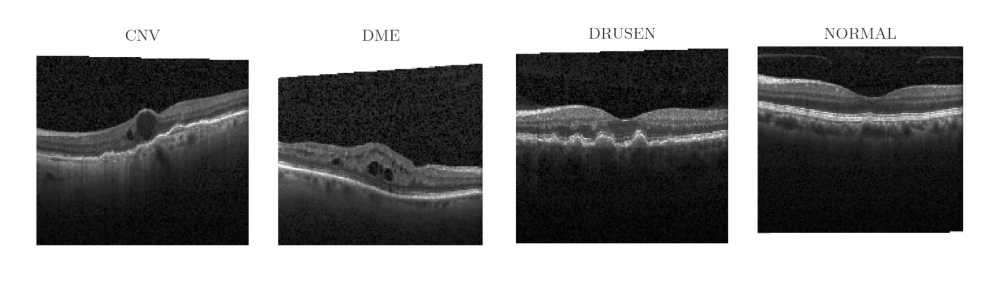

oct-diagn-semi-supervised
==============================

[](https://paperswithcode.com/sota/retinal-oct-disease-classification-on-oct2017?p=matching-the-clinical-reality-accurate-oct)

Semi-supervised classification of Retinal OCT images



Project is based on:
- [Cortex](https://github.com/rdevon/cortex) - wrapper around Pytorch
- [MlFlow](https://mlflow.org/) - experiments tracking

ArXiv: [arxiv.org/abs/2010.12316](https://arxiv.org/abs/2010.12316)

Presentation: [KDAH-CIKM-2020-presentation.pdf](https://github.com/Valentyn1997/oct-diagn-semi-supervised/blob/master/reports/KDAH-CIKM-2020-presentation.pdf)

Installation
------------

1. Make sure, you have Python 3.7
2. Create a virtual environment:
    ```console
    pip install virtualenv
    virtualenv venv
    source venv/bin/activate
    ```
3. `pip3 install -r requirements.txt`
4. Install dev version of cortex:
    ```console
    git clone https://github.com/rdevon/cortex
    cd cortex
    git checkout dev
    pip3 install -e .
    ```
   
MlFlow Server
------------
To run your own MlFlow Server with experiments:
`mlflow server --default-artifact-root='mlruns/'`

Running scrips
------------

#### Data download
To download **UCSD dataset** from [Kaggle](https://www.kaggle.com/paultimothymooney/kermany2018) set up your [Kaggle credentials](https://www.kaggle.com/docs/api) and run:
`PYTHONPATH=. python3 src/data/download.py`

#### Simple training

Fully-supervised model: `PYTHONPATH=. python3 src/models/full_supervised/main.py`

    --d.sources ImageFolder 
    --name OCT2017 
    --data_args.image_size "(512, 512)" 
    --data_args.random_resize_crop "{'size': (256, 256), 'scale': (0.5, 1.0)}" 
    --data_args.image_size_test "(256, 256)" 
    --t.epochs 25 
    --d.shuffle True 
    --data_args.normalize True 
    --data_args.flip 
    --o.learning_rate 0.001 
    --data_args.split_labelled_and_unlabelled 
    --v.viz_off 
    --log_to_mlflow True
    
For Transfer Learning add three arguments: 

    --data_args.n_labels 200 
    --pretrained 
    --freeze_layers True

MixMatch: `PYTHONPATH=. python3 src/models/mix_match/main.py` 

    --d.sources ImageFolder 
    --name OCT2017 
    --data_args.image_size "(512, 512)" 
    --data_args.random_resize_crop "{'size': (256, 256), 'scale': (0.5, 1.0)}" 
    --data_args.image_size_test "(256, 256)" 
    --t.epochs 1000 
    --d.shuffle True 
    --data_args.n_labels 200 
    --data_args.normalize True 
    --data_args.split_labelled_and_unlabelled 
    --data_args.flip 
    --lambda_u 25 
    --log_to_mlflow True 
    --v.viz_off
            
FixMatch: `PYTHONPATH=. python3 src/models/fix_match/main.py` 
                
    --d.sources ImageFolder 
    --name OCT2017 
    --data_args.image_size "(512, 512)" 
    --data_args.random_resize_crop "{'size': (256, 256), 'scale': (0.5, 1.0)}" 
    --data_args.image_size_test "(256, 256)" 
    --t.epochs 2000 
    --d.shuffle True 
    --data_args.n_labels 200 
    --data_args.normalize True 
    --data_args.split_labelled_and_unlabelled 
    --data_args.flip 
    --log_to_mlflow True 
    --data_args.mu 4 
    --data_args.fix_match_transform 
    --v.viz_off

#### Hyperparameter search / Varying number of labels

Set-up search grid dict in `src/<model_name>/varying_number_of_labels.py` and run
`PYTHONPATH=. python3 src/models/<model_name>/varying_number_of_labels.py`

    --d.sources ImageFolder 
    --name OCT2017 
    --type_of_run varying_number_of_labels / hparam_search
    --data_args.image_size "(512, 512)" 
    --data_args.random_resize_crop "{'size': (256, 256), 'scale': (0.5, 1.0)}" 
    --data_args.image_size_test "(256, 256)" 
    --d.shuffle True 
    --data_args.normalize True 
    --data_args.split_labelled_and_unlabelled 
    --data_args.flip 
    --log_to_mlflow True 
    
    # Optional for Transfer Learning
    --pretrained
    
    # Optional for Fix-Match
    --data_args.fix_match_transform

Project Organization
------------

    ├── LICENSE
    ├── README.md 
    ├── data
    │   └── OCT2017                     <- Dataset, loaded from https://www.kaggle.com/paultimothymooney/kermany2018, see src/data/download.py
    |       ├── test      
    |       ├── train     
    │       └── val       
    │
    ├── notebooks                       <- Jupyter notebooks
    |   ├── 00_dataset_statistics.ipynb <- OCT2017 exploratory data analysis
    |   └── 01_experiments.ipynb        <- Plots/graphs for experimental results  
    │
    ├── reports                         <- Generated analysis as HTML, PDF, LaTeX, etc.
    │   └── figures                     <- Generated graphics and figures to be used in reporting
    │
    ├── requirements.txt                <- The requirements file for reproducing the analysis environment
    │
    ├── setup.py                        <- makes project pip installable (pip install -e .) so src can be imported
    │
    └── src                             <- Source code for use in this project
        ├── data                        <- Scripts to download and manipulate data
        │   ├── dataset_plugins.py      <- Modification of default cortex DataLoaders for SSL
        │   ├── download.py             <- Script for data download
        │   ├── rand_augment.py         <- RandAugment functions
        │   └── transforms.py           <- Addiotional augmentations
        │
        └── models                      <- Scripts to train models and then use trained models to make predictions
            ├── fix_match               <- FixMatch
            |   ├── controller.py               <- Cortex controller 
            |   ├── main.py                     <- Train script 
            |   ├── utils.py            
            |   └── varying_number_of_labels.py <- Hyperparameter search / varying number of labels runs
            |   
            ├── full_supervised         <- Fully Supervised / Transfer Learning models
            |   ├── ...                          <- Same structure, as in src/models/fix_match
            |
            ├── mix_match               <- MixMatch
            |   ├── ...                         <- Same structure, as in src/models/fix_match
            |
            ├── utils.py
            └── wideresnet.py           <- Wide-Res-Net backbone
--------

<p><small>Project based on the <a target="_blank" href="https://drivendata.github.io/cookiecutter-data-science/">cookiecutter data science project template</a>. #cookiecutterdatascience</small></p>
